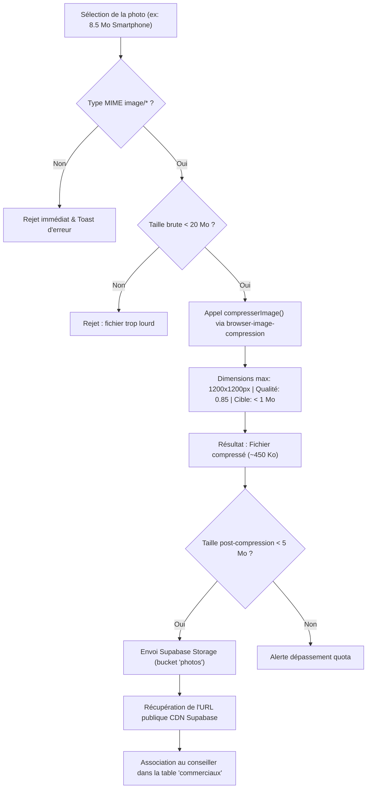

# Configuration Supabase Storage & Politiques de Sécurité (RLS) — Lou Ame Tay v2.0

Ce document détaille la configuration complète du stockage d'images pour le projet **Lou Ame Tay** (portraits des commerciaux, logos et assets de cartes digitales) sur la plateforme **Supabase**.

---

## 1. Contexte & Diagnostic de l'Erreur

### Symptôme rencontré
Lors de l'upload d'une photo de profil dans l'espace administration (`admin.html`), l'erreur suivante survenait :
```text
Échec upload photo: The object exceeded the maximum allowed size. Vérifiez que le bucket 'photos' existe et est public.
```

### Cause racine
1. **Dépassement de quota unitaire** : Les appareils photo de smartphones récents (iPhone, Samsung Galaxy, Xiaomi) produisent des clichés JPEG bruts pesant entre **6 Mo et 15 Mo**.
2. **Limite du bucket Supabase** : Le bucket `photos` possédait une restriction stricte `file_size_limit = 5242880` (5 Mo). Tout fichier supérieur à cette limite déclenchait un rejet immédiat HTTP 400 par l'API Storage de Supabase.
3. **Absence de compression côté navigateur** : Le fichier brut était envoyé tel quel sans redimensionnement ni ré-échantillonnage préalable.

---

## 2. Solution Implémentée (Double Protection)

1. **Côté Client (Navigateur)** :
   - Intégration de la bibliothèque `browser-image-compression` (via CDN jsDelivr).
   - Redimensionnement automatique : largeur/hauteur max **1200px**, qualité **0.85**, cible **< 1 Mo** (généralement **300 à 700 Ko**).
   - Réduction de taille moyenne de **85% à 95%** avant tout envoi réseau.
   - Pré-validation du type MIME (`image/*`) et rejet préventif des fichiers > 20 Mo.
2. **Côté Serveur (Supabase Storage)** :
   - Bucket public `photos` configuré avec une limite de sécurité assouplie à **10 Mo** (10 485 760 octets).
   - Politiques de sécurité RLS strictes sur `storage.objects`.

---

## 3. Configuration Manuelle via le Dashboard Supabase

Si vous configurez un nouveau projet Supabase ou modifiez le bucket via l'interface graphique :

### Étape 1 : Vérifier et ajuster le bucket `photos`
1. Connectez-vous sur [Supabase Dashboard](https://supabase.com/dashboard).
2. Dans le menu de gauche, cliquez sur **Storage**.
3. Repérez le bucket nommé **`photos`** (créez-le s'il n'existe pas en cochant **Public bucket**).
4. Cliquez sur le menu à trois points (**⋮**) à droite du bucket > **Edit bucket**.
5. Dans la fenêtre modale :
   - **Public bucket** : Activé (ON).
   - **Restrict file size** : Cochez l'option et indiquez `10 MB` (ou `10485760` octets).
   - **Allowed MIME types** : `image/jpeg, image/png, image/webp, image/svg+xml`.
6. Cliquez sur **Save**.

### Étape 2 : Vérifier les Politiques de Sécurité (Storage > Policies)
Dans **Storage** > **Policies**, vérifiez les 4 règles suivantes sur la table `storage.objects` :

| Nom de la règle | Opération | Rôle cible | Condition `USING` | Condition `WITH CHECK` |
| :--- | :---: | :---: | :---: | :---: |
| **Photos lecture publique** | `SELECT` | `public` (anon + authenticated) | `bucket_id = 'photos'` | — |
| **Photos upload administrateurs** | `INSERT` | `authenticated` | — | `bucket_id = 'photos'` |
| **Photos mise à jour administrateurs**| `UPDATE` | `authenticated` | `bucket_id = 'photos'` | — |
| **Photos suppression administrateurs**| `DELETE` | `authenticated` | `bucket_id = 'photos'` | — |

---

## 4. Script SQL Complet d'Initialisation & Réparation

Exécutez ce script dans l'éditeur SQL de votre tableau de bord Supabase (**SQL Editor** > **New Query**) pour configurer le bucket et ses règles en 1 clic :

```sql
-- ============================================================================
-- SCRIPT DE CONFIGURATION DU BUCKET 'photos' ET DES POLITIQUES RLS
-- ============================================================================

-- 1. Création ou mise à niveau du bucket 'photos' (public, limite 10 Mo)
INSERT INTO storage.buckets (id, name, public, file_size_limit, allowed_mime_types)
VALUES (
  'photos',
  'photos',
  true,
  10485760, -- 10 Mo en octets
  ARRAY['image/jpeg', 'image/png', 'image/webp', 'image/svg+xml']
)
ON CONFLICT (id) DO UPDATE SET
  public = true,
  file_size_limit = 10485760,
  allowed_mime_types = ARRAY['image/jpeg', 'image/png', 'image/webp', 'image/svg+xml'];

-- 2. Nettoyage des anciennes politiques pour éviter les doublons
DROP POLICY IF EXISTS "Photos lecture publique" ON storage.objects;
DROP POLICY IF EXISTS "Photos upload administrateurs" ON storage.objects;
DROP POLICY IF EXISTS "Photos mise a jour administrateurs" ON storage.objects;
DROP POLICY IF EXISTS "Photos suppression administrateurs" ON storage.objects;
DROP POLICY IF EXISTS "Accès public aux photos" ON storage.objects;
DROP POLICY IF EXISTS "Upload photos administrateurs" ON storage.objects;
DROP POLICY IF EXISTS "Suppression photos administrateurs" ON storage.objects;

-- 3. Politique SELECT : Tout le monde (public) peut visualiser les photos des cartes
CREATE POLICY "Photos lecture publique"
  ON storage.objects FOR SELECT
  TO public
  USING (bucket_id = 'photos');

-- 4. Politique INSERT : Seuls les administrateurs connectés peuvent uploader
CREATE POLICY "Photos upload administrateurs"
  ON storage.objects FOR INSERT
  TO authenticated
  WITH CHECK (bucket_id = 'photos');

-- 5. Politique UPDATE : Seuls les administrateurs connectés peuvent écraser/modifier
CREATE POLICY "Photos mise a jour administrateurs"
  ON storage.objects FOR UPDATE
  TO authenticated
  USING (bucket_id = 'photos');

-- 6. Politique DELETE : Seuls les administrateurs connectés peuvent supprimer
CREATE POLICY "Photos suppression administrateurs"
  ON storage.objects FOR DELETE
  TO authenticated
  USING (bucket_id = 'photos');
```

---

## 5. Fonctionnement de la Compression Côté Navigateur

Le fichier [`js/admin.js`](file:///C:/Users/DELL/Desktop/CRM%20LOUAMETAY.COM/lou-ame-tay-%E2%80%94-cartes-de-visite-digitales/js/admin.js) implémente le cycle de vie suivant :



### Spécifications de compression :
- **Bibliothèque** : `browser-image-compression` v2.0.2
- **Taille cible (`maxSizeMB`)** : `1` (1 Mo)
- **Dimension maximale (`maxWidthOrHeight`)** : `1200px`
- **Qualité initiale (`initialQuality`)** : `0.85` (85%)
- **WebWorker (`useWebWorker`)** : `true` (ne bloque pas l'interface utilisateur pendant le calcul)

---

## 6. Vérification & Tests de Non-Régression

Pour tester la chaîne complète :
1. Connectez-vous sur l'administration (`/admin.html`).
2. Cliquez sur **+ Nouveau commercial**.
3. Dans le champ photo, sélectionnez une photo haute résolution (ex: 8 Mo).
4. Constatez l'affichage instantané du badge : `nom_photo.jpg (8.0 Mo — sera optimisé)`.
5. Cliquez sur **Enregistrer le commercial**.
6. Le bouton affiche `Compression & envoi photo...`, la compression s'exécute en quelques millisecondes dans un WebWorker, puis le fichier de ~450 Ko est téléversé avec succès.
7. Le commercial apparaît immédiatement dans la liste avec sa photo hébergée sur Supabase Storage.
